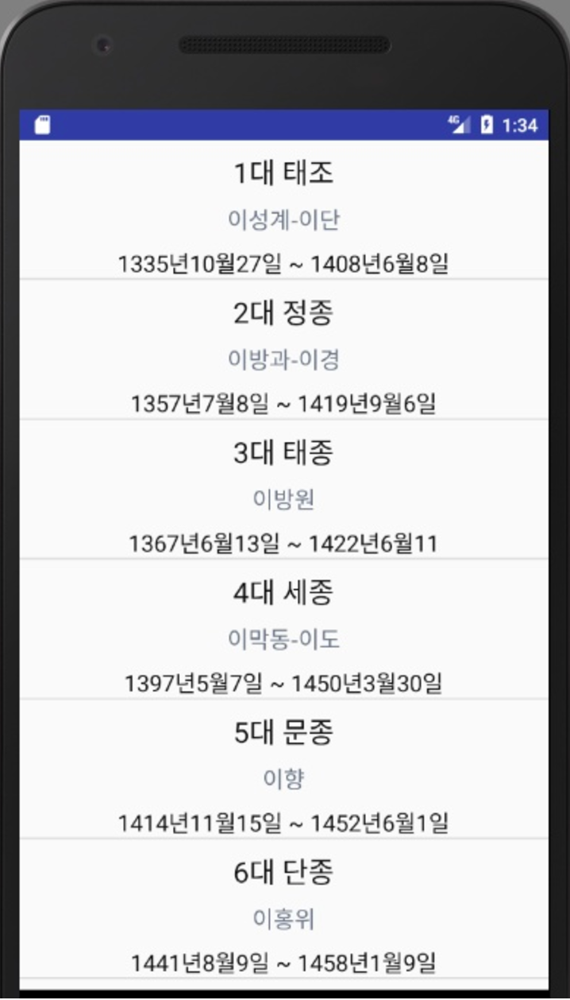

<h1>조선왕조실록 OneStore app</h1> 

  

<a href="http://m.onestore.co.kr/mobilepoc/apps/appsDetail.omp?prodId=0000712622&PrePageNm=/searchresult">다운로드</a> 
<h2>소개 및 출저</h2> 
tool = "android studio 
내용 출저는 <a href="https://namu.wiki/w/%EB%82%98%EB%AC%B4%EC%9C%84%ED%82%A4:%EB%8C%80%EB%AC%B8">나무위키</a> 이며 API는 ZoomTextView 를 이용하였습니다 
zoomTextView <a href="https://github.com/nomanr/ZoomTextView">출저</a> 
ListView 
이상 입니다 감사합니다.

